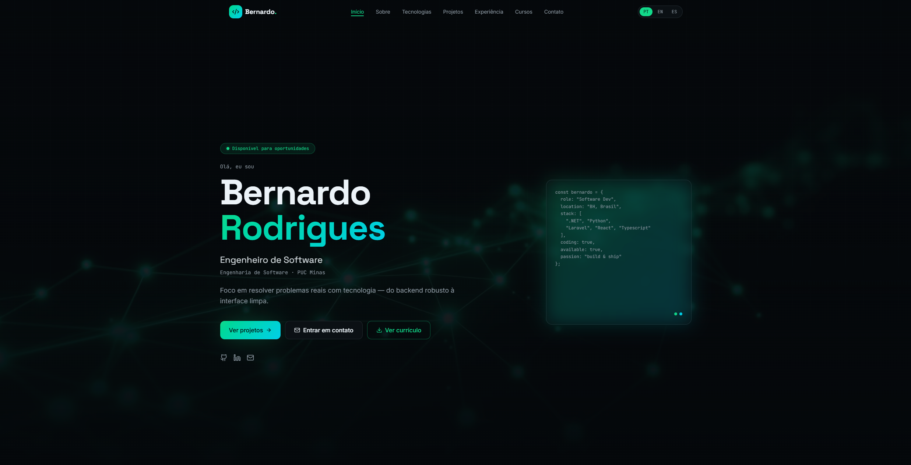

# 🚀 Bernardo Rodrigues — Portfolio



---

## 📦 Repository Overview

This repository contains my personal developer portfolio, built using **React + Vite**, designed to showcase my projects, skills, and professional experience in a **modern, interactive, and visually engaging way**.

---

## 🖥️ About the Experience

This portfolio focuses on delivering a clean, fast, and interactive experience.

- ⚡ High performance with Vite  
- 🎨 Modern UI  
- 📱 Fully responsive  
- 🌐 Multilingual support  
- 📄 Resume visualization  
- 📊 Dynamic project showcase  

---

## ✨ Features

- 👤 About section  
- 🧠 Skills visualization  
- 📂 Projects showcase  
- 🐙 GitHub integration  
- 📄 Resume viewer  
- 📩 Contact system  
- 📅 Calendly integration  
- 📊 WakaTime stats  
- 🎵 Spotify integration  

---

## 🛠️ Tech Stack

- React  
- TypeScript  
- Vite  
- Tailwind CSS / Custom CSS  
- Supabase  
- EmailJS  
- GitHub API  

---

## 📂 Project Structure

```
📦 src
┣ 📂 assets       # Images and static resources
┣ 📂 components   # Reusable components
┣ 📂 ui           # Design system components
┣ 📂 config       # API and environment configs
┣ 📂 lib          # External service integrations
┣ 📜 router.tsx   # Routing configuration
┣ 📜 styles.css   # Global styles
┗ 📜 main.tsx     # Application entry point
```

```
/public
```

---

## 🚀 Running Locally

```bash
git clone https://github.com/your-username/your-repo.git
cd your-repo
npm install
npm run dev
```

Then open:  
http://localhost:5173

---

## 📬 EmailJS Configuration

This project uses EmailJS to send emails directly from the frontend.

### Required Environment Variables

```env
VITE_EMAILJS_SERVICE_ID=
VITE_EMAILJS_TEMPLATE_ID_FOR_ME=
VITE_EMAILJS_TEMPLATE_ID_FOR_SENDER=
VITE_EMAILJS_PUBLIC_KEY=
```

### Features

- Sends notification email to you  
- Sends confirmation email to the user  
- No backend required  

---

## 🐙 GitHub API Integration

Used to dynamically fetch repositories.

### Environment Variable

```env
VITE_GITHUB_TOKEN=
```

### Example Fetch

```javascript
fetch(`https://api.github.com/users/${USERNAME}/repos`, {
  headers: {
    Authorization: `token ${TOKEN}`,
  },
});
```

---

## 📝 Supabase (Guestbook)

Used to store visitor messages.

### Table Structure

```sql
create table guestbook_messages (
  id uuid primary key default gen_random_uuid(),
  name text,
  message text,
  created_at timestamptz default now()
);
```

### Environment Variables

```env
VITE_SUPABASE_URL=
VITE_SUPABASE_PUBLISHABLE_KEY=
```

---

## ⚙️ Keep Supabase Alive (GitHub Actions)

```yaml
name: Keep Supabase Awake

on:
  schedule:
    - cron: "0 */12 * * *"

jobs:
  ping:
    runs-on: ubuntu-latest
    steps:
      - name: Ping Supabase
        run: curl "$SUPABASE_URL/rest/v1/guestbook_messages?apikey=$SUPABASE_API_KEY"
```

---

## 🌐 Deployment

Recommended platforms:

- Vercel (recommended)  
- Netlify  
- Cloudflare Pages  

---

## 📌 Project Status

- ✅ Completed  
- 🚀 Continuously improving  

---

## 📬 Contact

- 💼 LinkedIn: (add link)  
- 📧 Email: (add email)  
- 🌐 Portfolio: (add link)  

---

## 📄 License

This project is licensed under the MIT License.

---

## 👨‍🚀 Author

**Bernardo Rodrigues**  
Software Developer  

_"Building real-world solutions with technology and purpose."_
